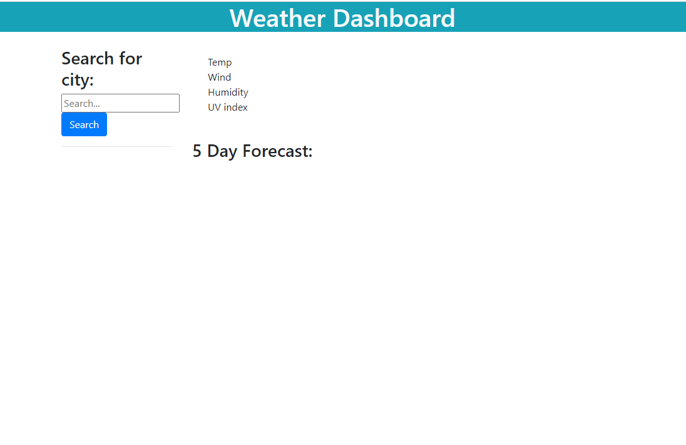
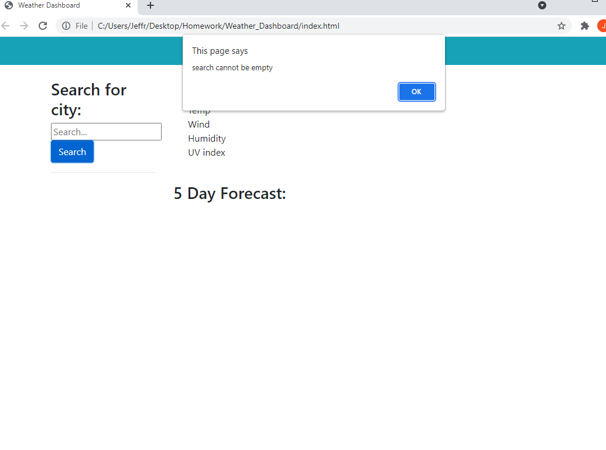
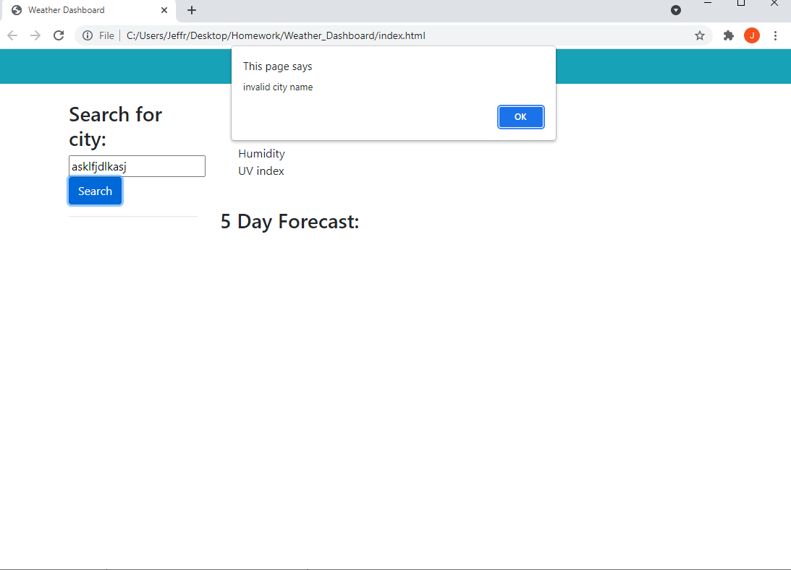
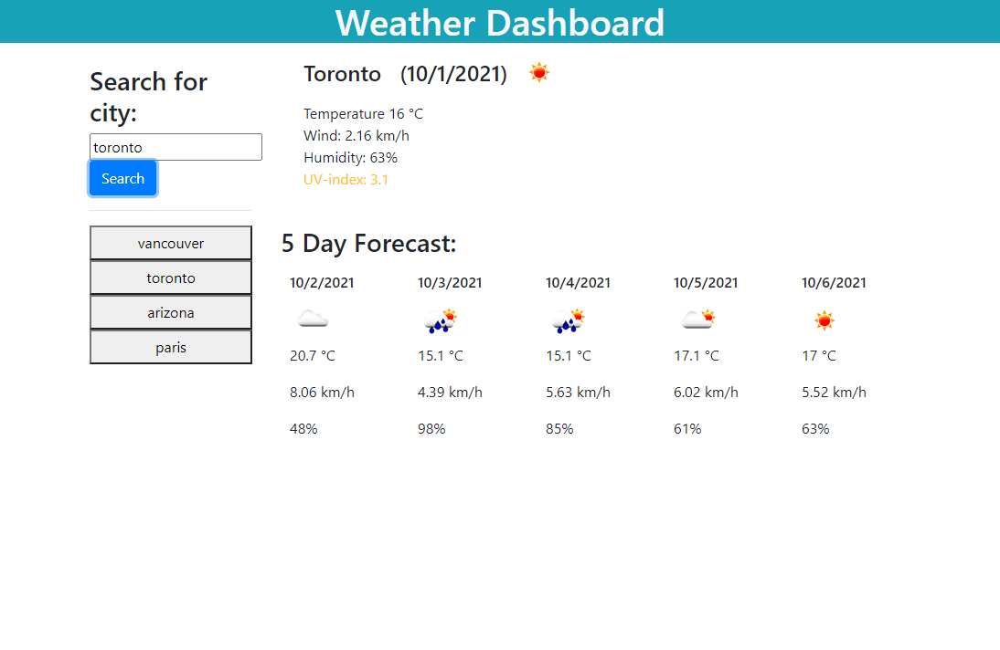

# Weather_Dashboard
This application uses the openweather API in to retrieve data based on the user's search input.
The user may enter text input in the given form, and upon pressing the search button:
    if the search box is empty or has an invalid cityname/value, an alert will popup notifying the user
if the search field is valid, the application displays:
the city name, date, an icon representing the current weather, wind speed, humidity and the UV-index.
These values are all obtained through the openweather API (excluding the date).

The UV index text will change color depending on the value. 0 < index < 2 Green, 2 < index < 4 Yellow, index 4 or higher Red 

Card then generated in the 5 day forecast section, showing the date, weather, temperature, wind, and humidity for each date.
These values are also obtained using another service within openweather API.

Valid values searched will be added below the search button as clickable buttons. When a button is clicked, it will display weather information for the corresponding button's city. These buttons are saved to local storage and are still on the page on page reload.

